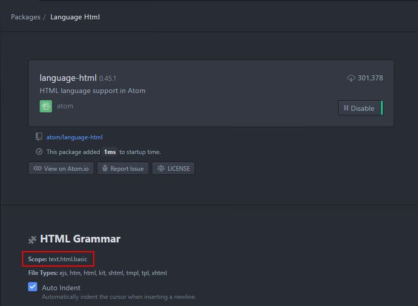

<!-- TOC -->

<!-- /TOC -->

# Add custom snippet in Atom

````coffee
'.text.md, .source.gfm':
  'Powershell':
    'prefix': 'ps'
    'body': '```ps1\n$1\n```'
  'rubyonrails':
    'prefix': '`r'
    'body': '```rubyonrails\n\n($1)```'
````

> Note<br>
> add code to `<user profile>.atom\snippets.cson`<br> 
> `'prefix': ps` refer to key combination that will trigger the snippet.<br> 
> `'body'` is the actual snippet text<br>
> `'.text.md, .source.gfm'`: this referred to file scope / language type.<br>
> more details find here [Link](https://www.hongkiat.com/blog/add-custom-code-snippets-atom/) <br>
> 

# Add custom command in Atom

````coffee
atom.commands.add 'atom-text-editor', 'markdown:paste-in-ps-tag', ->
  return unless editor = atom.workspace.getActiveTextEditor()

  selection = editor.getLastSelection()

  selection.insertText("``` ps1\n#{selection.getText()}\n```")
````

> Note<br>
> add code to `<user profile>.atom\init.coffee` file<br>
> We need to add key combination that will trigger the command.<br>
> more details find here
> [link](https://flight-manual.atom.io/hacking-atom/sections/the-init-file/)

# Add custom key binding in Atom

This is an example for adding key binding to our custom command

```coffee
'atom-text-editor':
  'ctrl-alt-p': 'markdown:paste-in-ps-tag'
```

> Note<br>
> add code to `<user profile>.atom\keymap.cson` file
