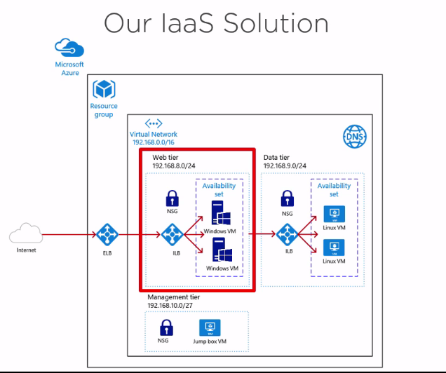
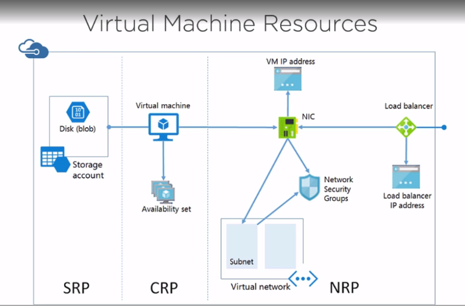

- Two ways to setup provate connection with Azure.
  - `Express Route` Site to Site private connection to Azure (bypass Internet).
  - via Private VPN.

- 3 Types of Cloud Delivery Models
  - SaaS (Target: customer/end users), Example: `Office 365`
  - PaaS (Target: developers), Example: Azure `App Service`
  - IaaS (Target: System Administrators), Example: `Azure VM`

- Get Started with Azure (Start Free (Need CR card))
 - after free can convert to Pay-as-You-Go
 - In free Tier, you can only use free Tier limited resources.

- ## IaaS Diagram

- Cost saving tips
 - stop VM (deallocate )after done to avoid charges.
 - Deleting VM doesn't delte the managed disk.
 - VM will be charged per miniutes so make sure to power off them when not using.
 - Schedule to power off VM to save money.
 - using your own license can save money.
 - per month estimate is assuming VM is online for month.

- Unable to connect to VM check NSG (Network Security Group), NSG is like firewall for Azure.
- `D:\` Drive in windows and `devsdb1` mount are temp disk and all data will loss on it.
- ## VM Resources Diagram
  - SRP Storage Resource Provider
  - CRP Compute Resource Provider
  - NRP Network Resource Provider
  - DNS is taken care automatically by Azure DNS
  - NSG Network Security Group is Software firewall
  

- We can use Azure online shell `Bash` or `Powershell`
- Azure cli v2 is a Python app which allow VM automation and run python scripts.

- ## Conneting VM
  - to connect VM via Powershell if VM is not added in AD Domain ,we need to add VM to trusted host list to be able to remote into via Powershell.
  - we can connect via SSH as well.
  - RDP is possible but need to allow RDP port in NSG.

- ## Disks and Storage
  - there are 2 ways to manage disks.
    - Storage account (traditional)
    - Managed Disks (new way)
  - Types of Disks
    - Premium Disks (charged flat fee)
    - Standard Disks (charged per transaction per GB)
  - Premium Disks are fast and good for high IO apps.
  - Azure holds infinite lease on page blobs, VHD is stored as page blobs.
  - `Azcopy` command line tool for Azure storage.

- ## Storage Types
  - Blob Storage (Unstructured file data)
  - Table Storage (NoSQL semi-structured data)
  - Queue storage (Messaging data)
  - File storage (SMB file shares)

- ## Azure Load Balancer
  - There are two Internal and External Load Balancer

- ## VM Extensions
 - VM Extensions are agent installed on VM.
 - Example Backup Extension, Chef Client, Etc.
